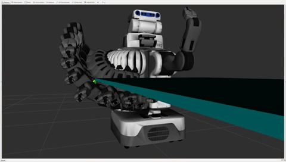
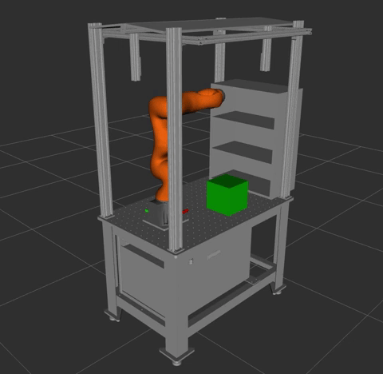
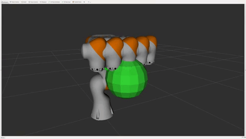
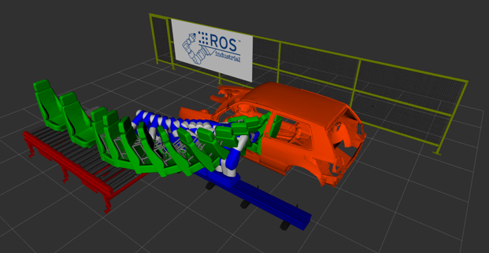
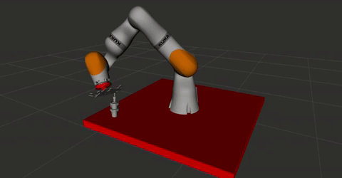

# trajopt_ros

Platform             | CI Status
---------------------|:---------
Linux (Focal)        | [](https://github.com/ros-industrial-consortium/trajopt_ros/actions)
Linux (Bionic)       | [](https://github.com/ros-industrial-consortium/trajopt_ros/actions)
Windows              | [](https://github.com/ros-industrial-consortium/trajopt_ros/actions)
Lint  (Clang-Format) | [](https://github.com/ros-industrial-consortium/trajopt_ros/actions)


[](http://github.com/ros-industrial-consortium/trajopt_ros/issues)

[](https://opensource.org/licenses/Apache-2.0)
[](https://opensource.org/licenses/BSD-2-Clause)

[](http://rosindustrial.org/news/2016/10/7/better-supporting-a-growing-ros-industrial-software-platform)

An optimizing path planner for ROS



## Solvers support
`trajopt_ros` implements sequential convex optimization to solve the motion planning problem.
It implements a penalty method to optimize for joint velocities while satisfying a set of constraints.
Internally, it makes use of convex solvers that are able to solve linearly constrained quadratic problems.
At the moment, the following solvers are supported:
- `BPMPD` (interior point method, free for non-commercial use only)
- `Gurobi` (simplex and interior point/parallel barrier, license required)
- `OSQP` (ADMM, BSD2 license)
- `qpOASES` (active set, LGPL 2.1 license)

While the `BPMPD` library is bundled in the distribution, `Gurobi`, `OSQP` and `qpOASES` need to be installed in the system.
To compile with `Gurobi` support, a `GUROBI_HOME` variable needs to be defined.
Once `trajopt_ros` is compiled with support for a specific solver, you can select it by properly setting the `TRAJOPT_CONVEX_SOLVER` environment variable. Possible values are `GUROBI`, `BPMPD`, `OSQP`, `QPOASES`, `AUTO_SOLVER`.
The selection to `AUTO_SOLVER` is the default and automatically picks the best between the available solvers.

## TrajOpt Examples
If you're new to TrajOpt, a great place to start is [tesseract_ros_examples](https://github.com/ros-industrial-consortium/tesseract_ros/tree/master/tesseract_ros_examples). This contains a number of examples to get you started.
This package is no longer part of this repository, but is maintained over at `ros-industrial-consortium/tesseract_ros`.

Additionally, there is an industrial training module that covers TrajOpt for a pick and place application. That module can be found [HERE](https://industrial-training-master.readthedocs.io/en/melodic/_source/demo3/index.html).
#### Pick and Place
The pick and place example is great place to start because it shows a complete end to end process using TrajOpt. While the code itself is quite long, this is because it is showing setting up and solving 2 problems (the pick and the place) as well as attaching and detaching objects in Tesseract. It makes use of the Tesseract TrajOpt Planner which simplifies some of the problem setup.

```roslaunch tesseract_ros_examples pick_and_place_example.launch```



### Basic Cartesian
Basic Cartesian shows how to use TrajOpt directly. It also shows doing collision checking against an octomap generated from a point cloud

```roslaunch tesseract_ros_examples basic_cartesian_example.launch```

### Glass Upright
This example shows a robot avoiding a collision while keeping its end effector orientation upright. It demonstrates how competing costs and constraints can be combined to achieve the desired results

```roslaunch tesseract_ros_examples glass_upright_example.launch```



### Car Seat Demo
The car seat demo requires and external package. Clone the [Motoman driver](https://github.com/ros-industrial/motoman) into your workspace to use it. While it is quite complex, it shows the power of TrajOpt to plan using external axes and redundancy to solve complex manipulation tasks.

```roslaunch tesseract_ros_examples car_seat_example.launch```



### Puzzle Piece Demos
The puzzle piece examples show a small collaborative robot manipulaing a puzzle piece to debur the edges with either a fixed grinder or one with extra axes.

```roslaunch tesseract_ros_examples puzzle_piece_example.launch```

```roslaunch tesseract_ros_examples puzzle_piece_auxillary_axes_example.launch```


  


## Building with Clang-Tidy Enabled

Must pass the -DTRAJOPT_ENABLE_CLANG_TIDY=ON to cmake when building. This is automatically enabled if cmake argument -DTRAJOPT_ENABLE_CLANG_TIDY=ON is passed.

## Building TrajOpt Tests

Must pass the -DTRAJOPT_ENABLE_TESTING=ON to cmake when wanting to build tests. This is automatically enabled if cmake argument -DTRAJOPT_ENABLE_TESTING_ALL=ON is passed.

.. NOTE: If you are building using catkin tools, use `catkin build --force-cmake -DTRAJOPT_ENABLE_TESTING=ON`.

## Running TrajOpt Tests

TrajOpt packages use ctest because it is ROS agnostic, so to run the test call `catkin test --no-deps trajopt trajopt_sco`

## TrajOpt Benchmarks

TrajOpt's Google benchmarks can be built by building with the flag `DTRAJOPT_ENABLE_BENCHMARKING=ON`.

To run the benchmarks at compile time and save the results to a json file in the build directory, add the flag `-DTRAJOPT_ENABLE_RUN_BENCHMARKING=ON`

## Build Branch Sphinx Documentation

```
cd gh_pages
sphinx-build . output
```
Now open gh_pages/output/index.rst and remove *output* directory before commiting changes.
